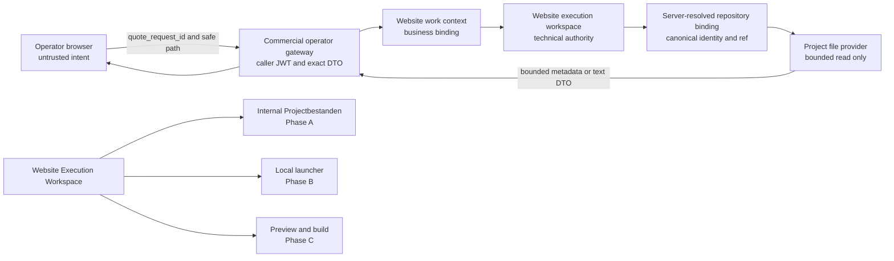

# Website Execution Build Workspace Design

Status: design approved; implementation not authorized
Date: 2026-09-17
Decision owner: LWS owner
Scope: generic Website Execution build cockpit architecture

## 1. Decision summary

The existing Website Execution Workspace becomes the customer website production and build cockpit. It remains the only managed website workspace for a dossier and keeps the canonical module-slot identity:

```text
dossiers:website-<quote_request_id>
```

Project files, development controls, the later local launcher, and the later preview/build surface live inside this managed child. This design creates no final-build singleton module and specifically forbids separate `dossiers:build-*`, `dossiers:editor-*`, or `dossiers:files-*` authorities.

The approved delivery sequence is:

- Phase A: repository-backed, read-only Projectbestanden.
- Phase B: context-bound local development launcher.
- Phase C: preview and build execution.
- Phase D: duplicate-slot window handoff repair.

These phases require separate authorization and release gates. Phase A does not authorize or depend on Phase B, C, or D implementation; a later phase may depend on a previously delivered contract or UI section.

## 2. Current product state

The factual production baselines at this design gate are:

- Static frontend release: `f94888318c74e79bf5e148d81d3eb892907798b8`.
- Production Edge Function: `commercial-operator-command` v118, ACTIVE.
- Generic workspace-provisioning deployed source: `7c7672980d31a92fea124727b41ca5eef6eec005`.
- Fetched `origin/main`: `f94888318c74e79bf5e148d81d3eb892907798b8`.

Current Operator architecture contains Dossiers, Project Workspace, Website Execution Workspace, and Project Requirements. Website Execution currently supplies technical status and references: work mode, repository state, branch, preview reference, production reference, last commit/build metadata, Requirements navigation, GitHub, VS Code Web, and a `Projectbestanden` control that only focuses the existing development container. It has no executable project file tree, project-file API, local launcher, editor, build worker, or preview worker.

`website_work_context_id` is the stable technical identity. A PRE_PROJECT context may have `project_id = null`. `website_execution_workspaces` is the single technical workspace authority. A unique workspace-to-work-context binding is a required server/database invariant and must be verified against the implementation baseline before code changes.

### 2.1 Implementation baseline warning

The live `commercial-operator-command` v118 contains generic workspace-provisioning support from commit `7c7672980d31a92fea124727b41ca5eef6eec005`, while current `origin/main` does not contain that commit. Git evidence at this gate shows `7c76729` is not an ancestor of `origin/main`, while `origin/main` is an ancestor of `7c76729`.

A later implementation plan must first reconcile the deployed backend source with its selected implementation baseline before modifying `commercial-operator-command`. It must compare and forward-integrate the deployed delta; it must not overwrite the live behavior blindly from `origin/main`. This design does not perform that reconciliation.

## 3. Product flow

The target operator flow is:

```text
Dossier
  -> Website openen
  -> Website Execution Workspace
  -> Requirements / Takenbord
  -> Projectbestanden / Ontwikkeling
  -> customer website development
  -> preview/build
  -> later production delivery
```

The operator does not enter a second build authority or third standalone build window. Website Execution owns the dossier-bound cockpit and composes subordinate capabilities without duplicating business identity or repository authority.

## 4. Decision record

### Alternative A: separate third build popup/module

Rejected. It would introduce another singleton identity, duplicate context handoff, increase focus/window failures, and invite a second technical authority for the same website work context.

### Alternative B: Website Execution with internal files/build sections

Approved. It preserves one authority and one canonical managed workspace, works with PRE_PROJECT, reduces window complexity, and matches the intent of historical Tasks 16-18: a context-bound launcher, server-side project-file reads, and an internal files view.

### Alternative C: external-only GitHub and VS Code links

Rejected as the final product architecture. External links remain useful references, but they do not provide an integrated, context-bound cockpit or deterministic repository-state UX.

```text
ARCHITECTURE_CHOICE=B
SEPARATE_BUILD_MODULE=NEE
CANONICAL_WEBSITE_SLOT=dossiers:website-<quote_request_id>
```

## 5. Phased delivery model

### Phase A: Project Files / read-only

Add a repository-backed Projectbestanden section inside Website Execution. It supports bounded directory browsing and safe text-file reading. It cannot create, write, rename, move, delete, commit, push, execute, download through temporary provider URLs, or render repository content as trusted markup.

Phase A is the first production capability and is independently releasable. It does not add a browser code editor.

### Phase B: local development launcher

Add a context-bound `Open in VS Code` workflow through a separately installed and approved local launcher. The launcher consumes short-lived server authority, resolves a local mapping owned by the local environment, verifies repository identity and expected branch, and then opens the verified root through an argument array. The browser never supplies a filesystem path or shell command.

### Phase C: preview/build execution

Add build request, status, result, log/status presentation, and preview linkage as a later capability. Build operations remain subordinate to the same `website_work_context_id` and `website_execution_workspace`; they do not create a second build authority or managed window.

### Phase D: window handoff UX

Repair duplicate-slot reuse separately. Project Requirements must focus the existing Website Execution child and request an internal handoff to Projectbestanden/Ontwikkeling without a visible blank reservation flash. This phase does not alter Phase A repository/file authority.

## 6. Architecture and data flow



No browser-provider credential, GitHub token, local path, or authenticated Git remote crosses this diagram.

## 7. Trust Boundaries

### Browser: untrusted intent

The browser may choose an action, the current `quote_request_id`, and a relative project path. It may return an opaque server-issued pagination cursor. It may not choose repository owner/name, installation, external repository ID, workspace ID when server-derivable, branch/ref, commit authority, provider URL, credential, or filesystem root. Existing GitHub navigation must use a server-projected allowlisted HTTPS URL or server redirect; this is navigation data only and never repository authority.

The browser renders repository names and file content as text. HTML, SVG, Markdown, filenames, errors, and provider values are never assigned as trusted HTML.

### Server: authority and policy enforcement

The commercial operator gateway validates the caller JWT, exact request keys, active human identity, owner role, and AAL2. It resolves the complete authority chain and applies path, file, size, encoding, state, and response policies. It forwards no raw provider error or credential.

### Database: business binding

The database binds quote request to website work context, execution workspace, repository lifecycle, canonical provider identity, binding revision, and allowed branch/ref. It owns cross-context isolation and remains authoritative when `project_id` is null.

### GitHub/provider: external repository source

The provider reads only the server-selected repository external ID and canonical commit/ref using server-held credentials. It cannot accept browser repository coordinates. Known, structurally valid symlinks, submodules, and Git links are returned only as inert unsupported directory metadata and are never followed. Unknown or malformed provider structures, redirects, canonical-path mismatches, and repository-root escapes fail the current request closed. Temporary URLs are never returned, and binary objects are never returned as content.

### Local developer machine: separate trusted operator environment

The local launcher owns local root configuration and human Git authentication. It validates a short-lived context-bound manifest against its own canonical mapping and checkout. It cannot trust browser paths, commands, remotes, branches, or repository identifiers.

## 8. Authority resolution

Every Project Files request resolves this chain server-side:

```text
caller JWT
-> active human owner at AAL2
-> quote_request_id
-> website_work_context_id
-> website_execution_workspace
-> repository-ready lifecycle
-> exact repository binding and binding revision
-> external repository ID
-> authorized branch/ref resolved to an immutable commit SHA
-> provider read
```

The browser does not send `website_work_context_id`, `website_workspace_id`, `project_id`, repository coordinates, external repository ID, installation ID, branch, ref, commit SHA, or provider host for Phase A. The server may return these as non-authoritative display metadata where safe. Every provider list page and blob read uses the immutable SHA resolved for that request or server-issued cursor; a moved branch affects only a newly resolved request.

A request is rejected if any link is absent, stale, ambiguous, cross-context, or not repository-ready. Prefixes and paths are locators, never authorization.

## 9. Authentication and authorization

Phase A policy is an authenticated human, ACTIVE owner, and AAL2. This is deliberately narrower than the roles that may currently view Website Execution status. The Projectbestanden section may remain visible to another status-authorized role, but file listing and content controls remain disabled with an access-denied state unless a later explicit policy revision authorizes that role.

The implementation must reuse caller-JWT propagation through `commercial-operator-command` and server/database authorization. It must not introduce service-role browser calls, manually assembled browser JWTs, local/session storage tokens, caller-supplied repository credentials, GitHub tokens in browser responses, or a parallel authentication transport.

## 10. Repository lifecycle UX

The cockpit remains visible in every valid website-workspace state. The files area is not conditionally removed.

| Workspace/repository state | Projectbestanden behavior | Other development behavior |
|---|---|---|
| No technical workspace | Explain that the technical workspace must be started; no file request | Existing authorized workspace-start control may remain |
| `PENDING_REPOSITORY` | Visible blocked state: repository is being prepared and files become available after binding | No GitHub, launcher, or preview capability inferred |
| `REPOSITORY_PROVISIONING` | Visible progress state; no file request | Refresh authoritative operation status only |
| `REPOSITORY_READY` | Enable Phase A listing/reading | GitHub reference allowed; Phase B/C controls only when separately implemented and authorized |
| `REPOSITORY_FAILED` | Explicit failure and server-projected retry guidance; clear file content | Never show stale repository content |
| Repository operation `BLOCKED` | Explain configuration/authorization block; no file request | Retry only through a separately authorized server action |
| Repository operation `QUARANTINED` | Explain identity verification block; no file request | No adoption, overwrite, or automatic repair |
| Legacy `READY` | Must be normalized and verified during implementation planning; file reads remain denied until the server proves an accepted repository-ready binding | No client inference from repository-looking fields |

A state transition away from repository-ready immediately clears the tree, selected file, content, cursors, and local launcher availability. Background refresh failure does not silently convert cached data into current authority; the UI marks it stale and disables further reads until revalidated.

The server projects `repository_failure_category`; the browser never derives it. Before projection, an unknown or unrecognized persisted repository operation is normalized to null. The following precedence is total and is evaluated from top to bottom:

| Priority | Repository operation | `repository_failure_category` |
|---|---|---|
| 1 | `QUARANTINED` | `QUARANTINED` |
| 2 | `BLOCKED` | `BLOCKED` |
| 3 | `TERMINAL_FAILED` | `TERMINAL` |
| 4 | `RETRYABLE_FAILED` or `RETRY_SCHEDULED` | `RETRYABLE` |
| 5 | `CLAIMED`, `CREATING`, `EXTERNAL_CREATED`, `VERIFYING`, or `COMPLETE` | null |
| 6 | null, including an unknown operation normalized to null | null |

If the workspace is `REPOSITORY_FAILED` without one of the recognized failure operations above, the category is null. This does not mean success: `repository_recovery_guidance` remains responsible for projecting `CONTACT_OWNER` for that state. For contradictory workspace/operation combinations, a recognized failure operation wins according to the precedence above; otherwise the category is null. `capabilities.project_files_read` remains false unless its separately defined exact ready/complete/verified condition passes.

Failure category and recovery guidance are different server projections. A null category never authorizes the browser to infer a category, success, recoverability, or retry authority.

```text
FINAL_BUILD_REQUIRES_REPOSITORY=JA
FINAL_BUILD_REQUIRES_PROJECT_ID=NEE
PROJECT_FILES_ALLOWED_AT_PENDING_REPOSITORY=NEE
PROJECT_FILES_ALLOWED_AT_REPOSITORY_READY=JA
```

## 11. Phase A server API

The existing `commercial-operator-command` gateway remains the transport. The file-read action reuses the precise `read_website_project_file` name from reviewed design history; no deployed endpoint is claimed. Directory listing receives a companion action: `list_website_project_directory`.

Both actions use exact-key validation and return `Cache-Control: no-store` and `X-Content-Type-Options: nosniff`. Response contracts are versioned and contain no provider URL, credential, installation token, authenticated remote, or local path.

The existing `get_website_execution_workspace_v2(uuid)` RPC remains unchanged for backward compatibility. Phase A introduces the forward-only `get_website_execution_workspace_v3(uuid)` RPC, which owns the new `WebsiteExecutionWorkspaceV3` contract. The commercial operator runtime may switch the Website Execution read route to v3 only during a later authorized Phase A implementation. V2 must not silently emit v3 semantics. Future executable tests must prove `V2_BACKWARD_COMPATIBILITY=PASS` and `V3_EXACT_CONTRACT=PASS`.

### 11.1 List directory

Request:

```json
{
  "action": "list_website_project_directory",
  "quote_request_id": "10000000-0000-4000-8000-000000000001",
  "path": "src/components",
  "cursor": null
}
```

`path` is a normalized repository-relative path; the empty string means repository root. `cursor` is null or an opaque server-issued continuation bound to caller, work context, repository external ID, binding revision, canonical commit, directory, and expiry. The client cannot construct a branch/ref cursor.

Success result, conceptually:

```json
{
  "contract_version": 1,
  "quote_request_id": "10000000-0000-4000-8000-000000000001",
  "website_work_context_id": "10000000-0000-4000-8000-000000000002",
  "workspace_state": "REPOSITORY_READY",
  "repository": { "display_name": "organization/repository", "binding_revision": 3 },
  "snapshot": { "commit_sha": "40-or-64-lowercase-hex", "ref_label": "main" },
  "directory": "src/components",
  "entries": [
    { "entry_type": "ENTRY", "name": "Header.astro", "path": "src/components/Header.astro", "kind": "FILE", "size_bytes": 2048, "readability": "READABLE_CANDIDATE", "selectable": true }
  ],
  "next_cursor": null
}
```

A directory/tree listing has metadata only. Before reading a regular blob, the server cannot truthfully know strict UTF-8 validity, byte-derived binary status, or sensitive content discovered from bytes. Therefore a normal unread blob is never labeled `TEXT` or `BINARY_UNSUPPORTED` from tree metadata.

The Phase A directory-entry contract is:

```ts
type WebsiteProjectDirectoryEntry =
  | {
      entry_type: "ENTRY";
      name: string;
      path: string;
      kind: "DIRECTORY" | "FILE" | "UNSUPPORTED";
      size_bytes: number | null;
      readability:
        | "DIRECTORY"
        | "READABLE_CANDIDATE"
        | "TOO_LARGE"
        | "SENSITIVE_BLOCKED"
        | "UNSUPPORTED";
      selectable: boolean;
    }
  | {
      entry_type: "BLOCKED_CREDENTIAL";
      name: "Geblokkeerd bestand";
      kind: "UNSUPPORTED";
      readability: "SENSITIVE_BLOCKED";
      selectable: false;
    };
```

The server applies this total directory mapping:

| Provider/tree fact | Projected entry |
|---|---|
| Tree/directory | `kind=DIRECTORY`, `readability=DIRECTORY`, `selectable=true` |
| Ordinary regular blob, safe pathname, declared size at most 1 MiB | `kind=FILE`, `readability=READABLE_CANDIDATE`, `selectable=true` |
| Ordinary regular blob, safe pathname, provider size null or unknown | `kind=FILE`, `readability=READABLE_CANDIDATE`, `selectable=true`; the authoritative 1 MiB limit still applies before and during the blob read |
| Ordinary regular blob, safe pathname, provider-declared size greater than 1 MiB | `kind=FILE`, `readability=TOO_LARGE`, `selectable=false` |
| Blocked credential or sensitive pathname | Exact redacted `BLOCKED_CREDENTIAL` variant; no path, original basename, size, object ID/SHA, or actionable target |
| Known symlink mode | `kind=UNSUPPORTED`, `readability=UNSUPPORTED`, `selectable=false` |
| Known commit/submodule/Git-link entry | `kind=UNSUPPORTED`, `readability=UNSUPPORTED`, `selectable=false` |

An unknown or unrecognized provider object type, unknown unsafe mode, malformed metadata, canonical-path mismatch, redirect, or repository-root escape does not produce an inert or partial item. It fails the entire current request closed as a provider-response or path-integrity failure. No directory entry exposes a provider object ID or SHA.

`TEXT` is a post-read success fact. `BINARY_UNSUPPORTED`, `UNSUPPORTED_ENCODING`, `SENSITIVE_FILE_BLOCKED`, and `FILE_TOO_LARGE` are authoritative read outcomes or errors; they are not guessed from normal tree metadata. These states add no browser editor semantics.

The server sorts entries deterministically by directory first and then Unicode code point order of normalized names. One response contains at most 500 entries and at most 512 KiB of serialized response data. Additional pages require an opaque cursor with a five-minute lifetime. An invalid, expired, replayed in a different context, or snapshot-mismatched cursor returns `PROJECT_FILES_CURSOR_INVALID`; an immutable commit no longer available from the provider returns `PROJECT_FILES_SNAPSHOT_UNAVAILABLE`. Directory traversal is lazy; recursive whole-tree export is not a Phase A operation.

### 11.2 Read project file

Request:

```json
{
  "action": "read_website_project_file",
  "quote_request_id": "10000000-0000-4000-8000-000000000001",
  "path": "src/components/Header.astro"
}
```

Success result, conceptually:

```json
{
  "contract_version": 1,
  "quote_request_id": "10000000-0000-4000-8000-000000000001",
  "website_work_context_id": "10000000-0000-4000-8000-000000000002",
  "workspace_state": "REPOSITORY_READY",
  "repository": { "display_name": "organization/repository", "binding_revision": 3 },
  "snapshot": { "commit_sha": "40-or-64-lowercase-hex", "ref_label": "main" },
  "file": {
    "path": "src/components/Header.astro",
    "size_bytes": 2048,
    "media_type": "text/plain",
    "encoding": "utf-8",
    "content": "escaped repository text"
  }
}
```

Each request resolves the authorized branch/ref to an immutable commit before provider access. If the canonical commit changes between list and a new read request, the read returns the newly resolved authoritative snapshot and the UI refreshes its tree before presenting the file. Cursor continuation remains pinned to its original immutable commit. Phase A does not permit a caller-selected old commit. A later immutable historical-view design may add a server-issued snapshot handle, not a free ref.

## 12. Project file security policy

### 12.1 Path normalization

The server decodes JSON exactly once and rejects malformed Unicode or encoded-path tricks. A path must be UTF-8, repository-relative, slash-separated, at most 1024 UTF-8 bytes, and contain at most 64 non-empty segments of at most 255 UTF-8 bytes each.

Reject:

- absolute paths, drive prefixes, UNC paths, URLs, backslashes, leading slash, and trailing ambiguity;
- empty internal segments, `.` or `..` segments, null bytes, control characters, and invalid UTF-8;
- percent-encoded separators, dots, or nulls after the JSON value has been parsed;
- Unicode values whose normalized form differs in a way that creates an ambiguous provider path;
- provider responses whose canonical returned path differs from the requested normalized path;
- any path escaping repository root.

The provider is addressed by repository external ID and immutable commit SHA resolved by the server. A known, structurally valid symlink, submodule, or Git-link/commit tree entry is not traversed and is returned only as `kind=UNSUPPORTED`, `readability=UNSUPPORTED`, `selectable=false`. The browser cannot read, follow, or expand it, no symlink target is fetched, and no submodule repository is followed.

An unknown object type, invalid mode/type combination, malformed canonical path, repository-root escape, redirect, or provider canonical-path mismatch fails the entire current request closed. No partial unsafe entry is returned.

### 12.2 Cross-context isolation

Every request re-resolves the complete chain from caller and `quote_request_id`. Supplying a known path from another customer cannot influence repository selection. The server validates work context, binding revision, and marker identity from authoritative database state. Provider responses are validated only against the expected external repository identity, immutable commit, object type, and canonical returned path before content is returned.

Tests require two independent synthetic work contexts A and B. Every A-with-B identifier, path assumption, cursor, response substitution, external ID, marker, and local mapping must fail closed without provider content leakage.

### 12.3 Secret and sensitive files

Deny before content return:

- exact `.env` and `.env.local`;
- basenames beginning `.env.` except exact `.env.example`, `.env.sample`, and `.env.template`;
- private-key and keystore forms including `*.pem`, `*.key`, `*.p12`, `*.pfx`, `id_rsa`, `id_ed25519`, and analogous private identity files;
- exact credential stores such as `.git-credentials`, `.netrc`, `.npmrc`, `.pypirc`, `credentials.json`, and `service-account.json`;
- provider-token basenames selected by the deterministic policy below;
- internal control material under `.git/` and the binding marker `.lws/project.json`;
- files classified by server policy as credentials, tokens, secrets, or private keys.

`.env.example`, `.env.sample`, and `.env.template` are not denied merely by name. They still pass content inspection. High-confidence secret content such as a private-key header, authenticated remote, access token, or non-dummy credential assignment blocks the entire file. The server returns a stable `SENSITIVE_FILE_BLOCKED` state and never returns partial sensitive content. The policy uses explicit normalized names and content classifiers, not a careless substring match.

For provider-token matching, the repository-relative safe path and Unicode normalization rules have already been applied. The server inspects the basename only and compares it case-insensitively. A basename is blocked when it consists of an optional leading `.`, a provider name `github`, `gitlab`, `npm`, or `provider`, an optional separator `-`, `_`, or `.`, the literal `token`, and an optional suffix that begins with `-`, `_`, or `.` and otherwise contains only lowercase ASCII letters, digits, `.`, `_`, or `-`. The semantic rule and examples are authoritative; an equivalent implementation regex may be `^\.?(?:github|gitlab|npm|provider)(?:[-_.]?token)(?:[-_.][a-z0-9][a-z0-9._-]*)?$` with case-insensitive matching.

The provider-token policy must block:

```text
.github-token
.gitlab-token
.npm-token
.provider-token
github-token
gitlab-token
npm-token
provider-token
github_token
github.token
githubtoken
.github-token.local
github-token.backup
gitlab_token_prod
npm.token.dev
PROVIDER-TOKEN
.GITHUB-TOKEN
```

It must allow:

```text
github-actions.yml
provider-config.json
npm-package.json
tokenizer.ts
github-tokenizer.txt
gitlab-ci.yml
package.json
build-token-view.mjs
```

Existing separately blocked files such as `.npmrc` and `.git-credentials` remain blocked by their own exact rules. Every blocked credential or sensitive pathname is represented in a directory listing only by the exact generic `BLOCKED_CREDENTIAL` variant. No original basename, path, content preview, size, object ID/SHA, actionable target, or download link is provided.

## 13. File limits and content classification

- Maximum readable decoded file size: 1 MiB (1,048,576 bytes), measured after provider transport decoding and before UTF-8 interpretation.
- Provider metadata is checked before blob retrieval where available; streamed bytes are hard-stopped at the limit plus one byte.
- Supported content encoding: strict UTF-8, with or without UTF-8 BOM. The BOM is removed from display content.
- UTF-16, legacy encodings, malformed UTF-8, and mixed/unknown encodings return `UNSUPPORTED_ENCODING`.
- Binary detection uses provider object type, MIME evidence, null/control-byte heuristics, and strict UTF-8 validation. A filename extension alone cannot make binary data readable.
- Oversized files return `FILE_TOO_LARGE`; no truncation and no partial content are returned.
- Binary files return metadata with `BINARY_UNSUPPORTED`; no inline bytes, data URL, object URL, or download URL is returned.
- HTML, SVG, XML, Markdown, JSON, JavaScript, CSS, and template source are inert text. The UI uses text nodes or equivalent escaping and never executes, previews, or injects them.
- Directory pages are limited to 500 entries and 512 KiB serialized output with opaque continuation.
- Production defaults are at most 30 list/metadata requests and 10 file-content requests per caller/work context per minute, at most four in-flight provider reads per caller, and a ten-second provider timeout. These ceilings are server-configured, may only become stricter without a contract revision, and require executable boundary tests. No automatic provider retry occurs after a request may have reached the provider.

Deterministic blocked states are part of the API contract rather than inferred from provider messages. Invalid cursor, unavailable snapshot, missing directory, path-kind mismatch, provider throttling, provider timeout, malformed provider response, and unavailable secret-classification service produce stable normalized codes and no file content.

## 14. Phase A user interface

The internal Projectbestanden section contains:

- repository and lifecycle header;
- lazy directory/file tree;
- breadcrumb constrained to repository root;
- selected-file path, size, encoding, snapshot commit, and read-only status;
- inert, selectable text content surface;
- refresh action that revalidates workspace and repository authority;
- loading, empty directory, repository-not-ready, access-denied, provider-unavailable, file-not-found, sensitive, binary, unsupported-encoding, oversized, stale-binding, and generic fail-closed states.

Selection and expanded-directory state may remain in memory while the authoritative context is unchanged. It is cleared on logout, revoke, module disposal, workspace/context/binding revision change, repository state downgrade, or authorization failure. Repository content is not stored in localStorage, sessionStorage, IndexedDB, service-worker caches, or URL fragments.

`Projectbestanden` becomes a real internal section selector/focus action. It is not a request for `dossiers:main` and does not open another managed window. No dead control is shown: Phase B and C controls remain absent until their capabilities and server permissions exist.

## 15. Development controls by state

### PENDING_REPOSITORY

Show the development section and a clear waiting state: `Repository wordt voorbereid. Projectbestanden zijn beschikbaar zodra de repository gekoppeld is.` Do not issue file API calls.

### REPOSITORY_READY

Enable Projectbestanden for an authorized owner+AAL2 caller. Preserve the existing safe GitHub reference/open action. Show `Open in VS Code` only after Phase B capability discovery and authorization. Show preview/build controls only after Phase C implementation and authority.

### Failed, blocked, or quarantined

Show the exact normalized lifecycle category and server-projected recovery guidance. Clear stale files and disable launcher/build actions. Never infer recoverability or retry authority in the browser.

## 16. Phase B local VS Code launcher

The constrained mechanism selected for further design is a separately installed local LWS launcher/resolver, not a free `vscode://file` URI and not a browser-supplied shell command. Phase B defines constraints only and is not implementation-ready: a separately approved protocol must define browser-to-launcher transport, manifest redemption, local-listener origin protection, audience/device binding, atomic nonce consumption, and replay-race handling.

```text
LAUNCH_AUTHORITY=Short-lived, one-time server manifest bound to caller, quote request, website_work_context_id, workspace binding revision, external repository ID, marker identity, canonical remote, expected branch, expiry, and nonce.
LOCAL_PATH_MAPPING=Launcher-owned mapping under owner-configured allowlisted canonical roots, keyed by website_work_context_id; browser paths are forbidden.
REPOSITORY_IDENTITY_CHECK=Exact canonical remote/provider external ID plus .lws marker context must match the manifest before open or clone.
EXPECTED_BRANCH_CHECK=Current checkout branch and resolved HEAD must satisfy the server manifest; mismatch blocks launch and is never auto-reset or force-switched.
MISSING_LOCAL_CLONE_BEHAVIOR=Offer a separately confirmed clone under the canonical context root using human Git authentication; never create a repository and never embed App credentials.
WRONG_REMOTE_BEHAVIOR=Hard fail, show repository mismatch, and perform no fetch, rewrite, or open.
WRONG_BRANCH_BEHAVIOR=Hard fail with expected/current branch information; perform no automatic checkout, reset, merge, or stash.
OFFLINE_BEHAVIOR=No new launch authorization; fail clearly. An already open editor remains outside browser control.
```

The launcher canonicalizes roots, rejects traversal, UNC/network roots unless separately approved, junction/symlink escape, case/Unicode aliasing, and context substitution. It invokes VS Code using a direct argument array. It never accepts a browser command, executable, environment variable set, arbitrary remote, branch, or path.

## 17. Phase C preview and build boundary

Phase C adds a server command conceptually shaped as bounded intent, for example:

```json
{
  "action": "request_website_preview_build",
  "quote_request_id": "10000000-0000-4000-8000-000000000001",
  "idempotency_key": "10000000-0000-4000-8000-000000000003"
}
```

The server resolves repository, exact commit, lockfile/toolchain policy, work context, workspace, and preview namespace. A subordinate build-operation ledger may record operation identity, commit, state, timestamps, normalized result, and redacted log references, but `website_execution_workspace` remains the technical authority.

Conceptual states are `QUEUED`, `RUNNING`, `PASS`, `FAIL`, `BLOCKED`, and `CANCELLED`. Website Execution projects current build request, build status/result, preview URL when verified, last build timestamp, and normalized failure. PRE_PROJECT may produce an internal preview but can never publish to production. Phase C does not authorize workers, infrastructure, deployment credentials, publishing, or production delivery.

## 18. Phase D window handoff defect

The independent proven defect is:

1. Project Requirements requests the existing `dossiers:website-<quote_request_id>` slot.
2. The child creates a transient named `about:blank` reservation under user activation.
3. The master detects the existing singleton slot, closes the reservation, calls `focus()`, and publishes `FOCUS_REQUEST`.
4. The browser does not reliably foreground the existing window, leaving a visible flash without an effective handoff.

Phase D must issue an acknowledged internal section handoff to Projectbestanden/Ontwikkeling, avoid a visible blank-popup flash, and request foreground focus. Because browser/OS policy can deny foregrounding, it must also provide a deterministic user-activated fallback to reach the already-open child. It must not create another build slot or weaken workspace lease/join/revoke checks.

No Phase D code belongs in the Phase A file-authority change.

## 19. Failure modes

| Condition | Server behavior | Website Execution behavior |
|---|---|---|
| Repository not ready | Stable `REPOSITORY_NOT_READY`; no provider read | Visible waiting/progress state |
| Repository binding missing | Stable `REPOSITORY_BINDING_MISSING` | Block files and show setup failure |
| Provider unavailable | Stable retryable unavailable code; no raw message | Keep context, clear/mark content stale, offer refresh later |
| File not found | Stable `PROJECT_FILE_NOT_FOUND` | Clear selected content and retain tree if still authoritative |
| Directory not found or wrong path kind | Stable `PROJECT_DIRECTORY_NOT_FOUND` or `PROJECT_PATH_KIND_MISMATCH` | Clear affected selection and retain only authoritative ancestors |
| Invalid/expired cursor or unavailable snapshot | Stable `PROJECT_FILES_CURSOR_INVALID` or `PROJECT_FILES_SNAPSHOT_UNAVAILABLE` | Discard pagination state and refresh from root |
| File too large | `FILE_TOO_LARGE`, metadata only | Oversized state, no truncation/download |
| Binary file | `BINARY_UNSUPPORTED`, metadata only | Unsupported/binary state |
| Sensitive file | `SENSITIVE_FILE_BLOCKED`, no content | Blocked state without secret-derived details |
| Access denied | Stable authorization code; no provider call where possible | Clear all file data and disable controls |
| Stale repository binding | `REPOSITORY_BINDING_STALE`; discard provider result | Clear tree/content and refresh workspace authority |
| Wrong provider branch/ref | `REPOSITORY_REF_MISMATCH`; no fallback ref | Block and require server-side reconciliation |
| Provider throttled, timed out, or malformed | Stable normalized provider code; no content and no raw response | Clear/mark content stale and offer a later refresh |
| Secret classifier unavailable | `SENSITIVE_CLASSIFICATION_UNAVAILABLE`; no content | Fail closed and offer a later refresh |
| Local launcher not installed | No manifest consumption | Explain launcher unavailable; GitHub reference may remain |
| Local clone missing | Launcher requires explicit clone confirmation | No browser-side clone claim |
| Wrong local remote | Launcher hard fail | Show local repository mismatch |
| Wrong local branch | Launcher hard fail | Show expected/current branch, no automatic mutation |
| Offline launcher | No new authorization | Explain offline/unavailable |
| Preview/build failure | Persist normalized failed operation, no publication | Show failure, timestamp, and redacted status |

Unknown, malformed, or contradictory states fail closed and expose no stale file content.

## 20. PRE_PROJECT behavior

PRE_PROJECT remains first-class. `project_id` may be null; no commercial project is fabricated for technical work. Authority is bound through `website_work_context_id` and the execution workspace.

Project file access requires a valid verified repository binding and repository-ready lifecycle. It does not require a commercial project. Production URL, commercial release, publication, invoicing, and delivery remain separate authorities.

## 21. Test strategy

### Server policy

Future tests must prove:

- authenticated ACTIVE owner and AAL2 are required;
- repository-ready gating blocks all earlier/failure states;
- repository identity, installation, branch/ref, and immutable commit are server-resolved;
- request exactness rejects repository/workspace/project/ref/credential fields;
- traversal, absolute, encoded, null, Unicode ambiguity, and provider path mismatch are rejected;
- secret filenames and high-confidence secret content are denied;
- directory listings use only `DIRECTORY`, `READABLE_CANDIDATE`, `TOO_LARGE`, `SENSITIVE_BLOCKED`, and `UNSUPPORTED`, while `TEXT` and byte-derived failures occur only after an authoritative read;
- known symlink, submodule, and Git-link objects return inert non-selectable unsupported entries, while unknown/malformed objects fail the whole request closed;
- the total repository-failure-category projection and browser non-inference rule hold for every workspace/operation combination;
- every provider-token must-block and must-allow basename example is enforced case-insensitively after normalization;
- `get_website_execution_workspace_v2(uuid)` remains backward-compatible and `get_website_execution_workspace_v3(uuid)` emits only the exact v3 contract;
- oversized, binary, and unsupported encoding reads return deterministic safe states;
- cursor expiry/context/snapshot binding, provider timeout/throttling/malformed output, and classifier outage fail closed;
- provider errors and temporary URLs do not leak;
- no mutation/provider-write method is reachable.

### UI

Future tests must prove:

- PENDING_REPOSITORY renders the visible blocked Projectbestanden area without a file request;
- REPOSITORY_READY renders lazy tree navigation and read-only file text;
- loading, empty, binary, sensitive, oversized, unsupported, denied, not-found, stale, and unavailable states are deterministic;
- provider content is rendered as text and cannot execute HTML/SVG/Markdown/script;
- state downgrade, context change, revoke, logout, and disposal clear content;
- no dead Phase B/C controls appear before capability availability.

### Genericity and isolation

Use at least two independent synthetic customer work contexts with distinct repositories. Test A-to-B substitutions for quote, context, workspace, external repository ID, marker, path assumptions, cursor, provider response, launcher manifest, and local mapping. Every cross-customer attempt must fail closed.

### Launcher

Test correct context mapping, canonical-root enforcement, traversal/junction/symlink escape, wrong remote, wrong external ID/marker, wrong branch, missing clone, offline behavior, expired/replayed manifest, argument safety, and absence of arbitrary path or shell input.

### Window

Test singleton reuse, no visible blank flash, focus acknowledgement or deterministic user-activated fallback, internal Projectbestanden handoff, lease/revoke preservation, and zero additional website/build child registrations.

### Build/preview

Phase C receives separate unit, integration, isolation, sandbox, artifact/cache namespace, lifecycle, preview-access, and PRE_PROJECT production-denial tests. These are not Phase A acceptance gates.

## 22. Phase A acceptance criteria

Phase A is acceptable only when all statements are proven:

1. Website Execution remains `dossiers:website-<quote_request_id>`.
2. PENDING_REPOSITORY permits zero project-file reads.
3. At REPOSITORY_READY, an authenticated ACTIVE owner at AAL2 can browse safe files only for that workspace.
4. No browser-supplied repository identity, workspace identity, project identity, provider, branch, ref, commit, credential, or local root is trusted.
5. No project file can be created, edited, renamed, deleted, committed, pushed, or executed.
6. Cross-customer access fails closed for two independent synthetic contexts.
7. Secret, binary, unsupported-encoding, oversized, symlink, submodule, and malformed files fail safely without content leakage.
8. Projectbestanden is internal to Website Execution and registers no new slot/module.
9. PRE_PROJECT works with `project_id = null` through `website_work_context_id`.
10. Browsing triggers no repository creation, provisioning, provider write, build, preview, publication, or production action.

## 23. Non-goals for the first implementation slice

- Repository creation or repository provisioning.
- Task14.
- Browser code editor.
- Project-file create/write/edit/delete/rename.
- Browser commits or Git pushes.
- Local launcher implementation.
- Preview/build execution or worker activation.
- Production deployment or automatic publishing.
- Window handoff/focus repair.
- HR, workforce, recruitment, or unrelated Operator modules.
- Changes to commercial, quotation, invoice, payment, or delivery authority.

## 24. Design invariants

```text
ONE_MANAGED_WEBSITE_CHILD=JA
NEW_BUILD_SINGLETON=NEE
SERVER_RESOLVES_REPOSITORY_AUTHORITY=JA
CLIENT_REPOSITORY_AUTHORITY=NEE
PROJECT_FILES_READ_ONLY=JA
PROJECT_FILES_REQUIRE_REPOSITORY_READY=JA
PROJECT_ID_REQUIRED=NEE
CROSS_CONTEXT_DEFAULT=DENY
BROWSER_PROVIDER_CREDENTIALS=0
LOCAL_PATHS_IN_BROWSER_REQUESTS=0
REPOSITORY_CREATION_BY_BROWSING=0
```

This document is an architecture specification, not an implementation plan. It authorizes no code, test, migration, provider, repository, database, Edge, deployment, push, Task14, or production mutation.
